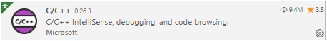
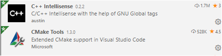
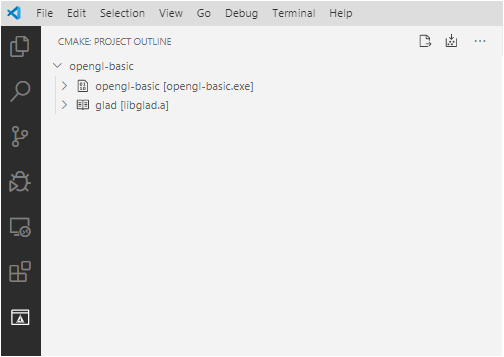
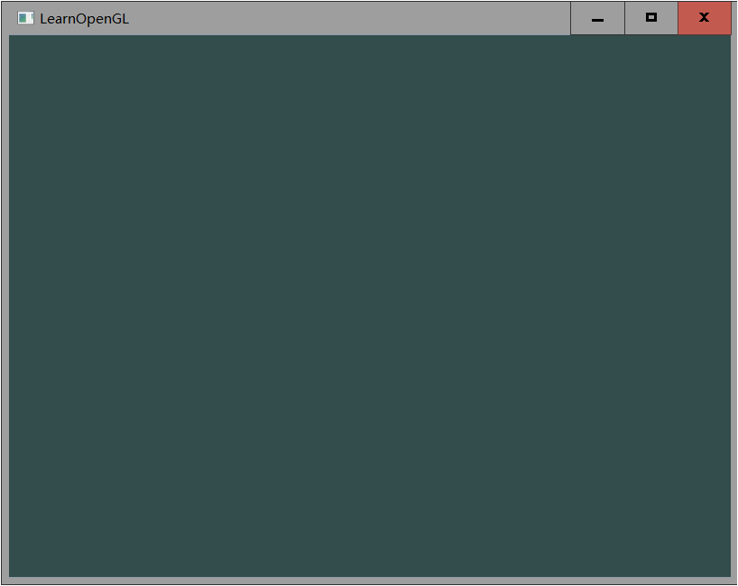

# linux configuration -opengl project

We use vscode + cmake to compile on Linux platform.

The configuration is now under Ubuntu 18.04.4. Other Linux versions operate similarly. Since the TAs do not use Macs, it is recommended that you use linux or windows whenever possible.

## Toolchain configuration

It mainly includes the following steps:

1. Install the C ++ compiler and other dependencies

   `sudo apt-get install g ++`

   `sudo apt-get install libx11-dev libxinerama-dev libxrandr-dev libxcursor-dev libxi-dev`

   `sudo apt-get install build-essential libgl1-mesa-dev`

   `sudo apt-get install libglfw3-dev libsdl2-dev`

2. Download and install VSCode and CMake.

   `sudo snap install code --classic`

   `sudo apt-get install cmake`

3. Install the following three plugins for VSCode For future development

   

   

   

4. Note that the cmake file path in the CMake Tools plugin is set correctly. For example, the snap installation needs to be set as shown below.

## OpenGL project configuration

First please find a folder git clone down your repository. If there is a problem in this step, google or Baidu `how to git clone`

After cloning the entire project, we first compile a library to be used with CMake.

### View our projects

Now, please open the opengl-basic-linux folder with VSCode. We have written the basic `CMakeLists.txt` for you and configured the OpenGL project.

Click the two buttons `configure` and` build` in turn. You can see `opengl-basic` in the` opengl-basic-linux \ build` folder

Double-click to start the program. If you see the following screen, it means that the opengl program has been configured correctly.

