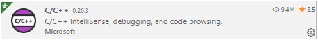
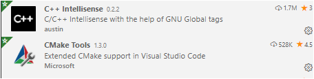
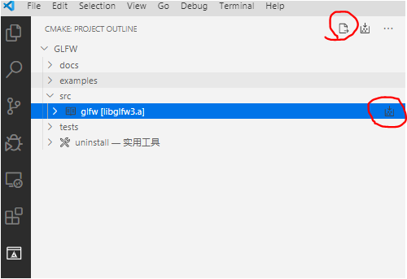
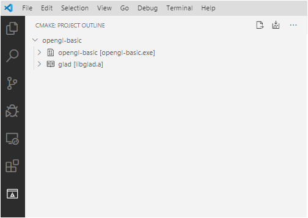
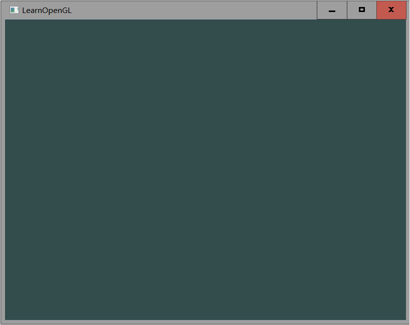

# windows configuration -opengl project

Here we use vscode + cmake + mingw to compile on the windows platform.

The main reason for not using visual studio is that linux platform does not support visual studio. I hope that in this process, you can learn more practical skills without transitioning to relying on visual studio.

In addition, there are two other reasons. Vscode is small and powerful, and cmake can provide cross-platform compilation.

If using visual studio, please refer to [here] (https://learnopengl-cn.github.io/01%20Getting%20started/02%20Creating%20a%20window/) and skip the following full text.

## Toolchain configuration

It mainly includes the following steps:

1. Download and install mingw from [link] (http://sourceforge.net/projects/mingw-w64/files/Toolchains%20targetting%20Win32/Personal%20Builds/mingw-builds/installer/mingw-w64-install .exe / download).

   -When installing, please select `x86_64`, it is recommended to install it in` C: \ mingw-w64` directory.
   -After installation, find the `bin` folder in the installation directory and copy the full path of the` bin` folder
   -Add the full path of the `bin` folder to the environment variable` Path`. If you have any questions, please google or Baidu.

2. Download and install VSCode and CMake. Many online tutorials will not be repeated.

3. Install the following three plugins for VSCode

   

   

   

## OpenGL project configuration

First please find a folder git clone down your repository. If there is a problem in this step, google or Baidu `how to git clone`

After cloning the entire project, we first compile a library to be used with CMake.

### Compile GLFW (skipable)

1. Open the `glfw-3.3.2` folder with vscode

   

   Go to the `CMake` Tab and click the two buttons` configure` and `build` in turn

2. Find `libglfw3.a` in` opengl-basic-windows \ 3rdLibs \ glfw-3.3.2 \ build \ src`, this is the generated library file, copy it to the `3rdLibs \ lib` folder

### View our projects

Now, open the opengl-basic-windows folder with VSCode. We have written the basic `CMakeLists.txt` for you and configured the OpenGL project

Click the two buttons `configure` and` build` in turn. You can see `opengl-basic.exe` in the` opengl-basic-windows \ build` folder

Double-click to start the program. If you see the following screen, it means that the opengl program has been configured correctly.

