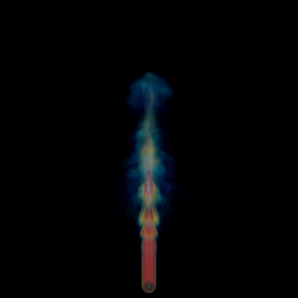

<!doctype html>

# **Assignment 5** - Volume Rendering Using Ray-casting

## **Introduction**

In this assignment, you will be dealing with volume rendering, which is a very common rendering technique in the industry for volume data. Volume data is widely used as a type of data source, such as CT data, smoke data, and so on.
In this assignment, you are required to write a Volume Ray-caster. Compared to volume texture projection with the "over" operator, the ray-casting method gives a much more detailed control for programmers to adjust the overall appearance. Implementing Ray-casting based volume rendering can also help you consolidate the basic knowledge of volume rendering. 
In the following, we will give you the specifics about what you need to accomplish, as well as some related guidelines to assist your programming.

* * *

## Recommended Resources

Before you start implementing your codes, here are some helpful resources when you are stuck with your code:

* [Volume Visualization and Volume Rendering Techniques](http://www.cs.unh.edu/~cs880/volvis/Meissner-VolRenderingEGTutorial.pdf)  

  A paper which introduces basic concept and common techniques of volume rendering.  

* [State of the Art in Transfer Functions for Direct Volume Rendering](https://www.researchgate.net/publication/304823671_State_of_the_Art_in_Transfer_Functions_for_Direct_Volume_Rendering)  

  A paper which describes the concept and common approaches of transfer functions.  

* [Realtime Volume Graphics](http://faculty.sist.shanghaitech.edu.cn/faculty/liuxp/course/cg1/materials/Real-Time%20Volume%20Graphics.pdf) 

  A more detailed book which reveals the underlying principles of volume rendering and introduces real-time techniques.

  

## **Things to be done**

Though there's a lot of work to do to implement the volume renderer, we provide a  framework that gives the basic functionality (such as 
accessing volume data, voxel indexing based on ray samples, ray-volume intersection, camera-ray generation, 
etc.). 

You only have to complete the core parts.

**[must]** A basic volume ray-caster requires you to implement 6 components:

1. *Volume pre-processing*  

   You should compute the gradient of the volume data (density). The initial volume data is a uniform grid, representing the density field. The density field is 1D scalar field. You can compute gradient using 
   the neighboring grid points.   

2. *Sampler*  

   When we shoot a ray through the volume, the sampler decides how we sample a data 
   point along the ray direction. Generally, a fixed step is sufficient. However, 
   adaptive step based on the importance of volume can be more efficient. For 
   simplicity, we recommend you use a fixed step.  

3. *Interpolator*  

   Interpolator helps you to decide the exact value of any sampled data point. The main idea is to interpolate data from nearby grid points. There are many  choices. You should implement following two kinds of interpolator. Details can be found in the 
       *Instructions* section.  

4. *Classifier*   

   When a data point is sampled and its associated values (in this case, density and 
   its gradient) are interpolated,  the classifier decides its color and opacity based on its values. You are required to complete 
   the following two sub tasks.   

5. *Compositor*   

   Composition is a process of collecting and integrating the color and opacity of your sampled point one by one.  You are required to complete 
   the either from-to back or back-to-front schemes.   

6. *Renderer*  

   A renderer which assembles all the components above and outputs the resulting image.

**[Optional]** You can choose to do optional job by either adding in-scattering using a phase function or adding volumetric shadow; then you will get optional scores. You should explain your implementation and show the comparison of results (before/after) in your report.

**Some specific requirements:**

*   Since you will be working on the CPU, we don't really ask for a very splendid image. You can render a relatively small-sized image, like around 500x500. However, we do not recommend resolutions below this, because in that case we might not be able to see your results clearly.
*   Your rendering result of the volume should have relatively clear structure and little noise. Your score will also be adjusted based on the 
  quality of your rendering result.

## **Submission & demonstration**

After you finish the project, you need demonstrate your work to TAs. Since now most of us have been back to school, we will have a specific face-to-face time 
to check the assignment. However, <u>the source code</u> and <u>a technical report</u> are still required to 
be submitted via GitHub Classroom in time.

 **Submission deadline**: 22:00, 2020-6-4

 **Demonstration time**: TBD

### **Requirements for technical report:**

For technical report, we require you do it with[LaTex](https://www.latex-project.org/), and you can use[TeXstudio](https://www.texstudio.org/) to facilitate your editing. The [LaTex](https://www.latex-project.org/) template for your technical report is provided within the repository of code template. In the report, you should describe your main work and essential results.
<u> Notice</u>:

*   You need to show the final rendering result displaying all the required items and show comparisons with different choices  respectively (ways of interpolation, different step-size and different composition scheme) in the report.
*   If you choose to do the optional part, please specify the process in the report.
*   The report must <u>follow the LaTex template</u>and be written <u>in English</u> only.
*   Failure to present your work clearly could lead to doubts about plagiarism or grade deduction.
*   Be aware that it is NOT a place to display large chunks of codes.
*   Put the <u>PDF version</u>of your report in the <u>root directory</u>of your repository. Otherwise, your report might not be graded.
*   Failure to satisfy the above requirements could lead to grade deduction.

### **Requirements for source code:**

Make sure that the source code you submitted is written by yourself independently. In serious cases, if similar codes are found, we might consider possibilities of plagiarism.

* * *

## **Grading rules**

*   The**[must]**items describe the requirements that you must meet in your project. If you fulfilled that perfectly according to the requirements and demonstrated your work successfully via the recorded video, you will get all the scores for the programming part. However, if you do not submit a valid source code, your grade of this assignment will be 0.
*   You can choose to do the**[optional]**item, and if you choose to do it, you will get additional scores based on the additional work you have done. But the maximum additional score will not exceed 20% of the entire score of this assignment.
*   In addition to programming, you need to submit a technical report specifying the details of your implementation: what you have done and how you achieved them. Not submitting these files will have your grade for demonstration and report deduced.
*   If we find out any form of plagiarism (including source code, video and technical report) in your work, your score of the assignment will be 0.
*   Late submission of your assignment may subject to score deduction. Please refer to[Late hand-in policy](http://faculty.sist.shanghaitech.edu.cn/faculty/liuxp/course/cg1/) for details.

## **Notice before you start**

*   We provided a skeleton code that might help you to achieve the requirements, which you will see when you accepted the assignment on GitHub classroom. Though we have tested the skeleton code to the best of our abilities, it might still have bugs hidden. When you believe something is wrong with the skeleton code, don't hesitate to contact TAs or post the problem in Piazza.
*   There are recording of  offline tutorials that might get you started, which you can download from the same place that you download the lecture videos. There might be some differences between the skeleton code in the tutorial videos and the actual skeleton code. Please follow the requirements on this page, not the video, for the reason that the skeleton code in the video is somewhat outdated and only used for demonstration
*   Debug option is for debugging purposes and we recommend that you use release option at all times when you are eager to see the result.
*   You are not allowed to use any libraries in the project unless it is provided in the skeleton code

* * *

## **Instructions**

Most explanations of code structures will be presented in offline tutorials and recorded in videos. Here we only give some specifications and guidance to make your life easier.

1. *gradient computing* 
  You should fill `computeGradients()` in` src/volume.cpp`. You may consider using [central difference](https://en.wikipedia.org/wiki/Finite_difference) to compute the gradients for all volume data in `volume.raw_data`  and store it as a member variable `gradient` in `volumeData`.  

2. *Sampler*

    You are free to use a fixed or adaptive step when sampling along the ray. However, it is much more reasonable to follow the sampling theorem that was described on *page 43 of lecture19*.  

3. *Interpolator*   

    You are required to implement two kinds of interpolator ([Nearest Neighbour Interpolator](https://en.wikipedia.org/wiki/Nearest-neighbor_interpolation) and 
    [Trilinear Interpolator](https://en.wikipedia.org/wiki/Trilinear_interpolation)) and compare rendering results. The main idea is to get the importance weight of  a data point based on its position in a voxel and interpolate other attributes (density 
    and gradient) using the weight. Using trilinear interpolator shall eliminate artifacts.  

4. *Classifier*   

   Here are two subtasks:  

   + Customize your transfer function  

   + Local Phong shading model   

   The classifier works as a mapper from the volume data to optics data, giving the color and opacity that will be used in the composition process. To determine the color, you shall consider emission and in-scattering. You could model the emission using the Phong lighting model (taking the gradient direction as normal). The in-scattering belongs to the optional part which can be neglected here.

   Then, you have to decide on the opacity. Opacity is the opposite concept of transparency. When opacity equals to 0, it means no energy will be absorbed. Higher density generally implies high absorption. You shall design and tune your transfer function.

   Besides, you should find a way to make use of gradient to enhance the smoke structure.

   You should be clear that we are doing the discrete form of calculus integration, so the energy and absorption should also be related to your step-size to correctly approximate as a Riemann sum.  

5. *Compositor*  

   You are required to implement two composition schemes (from-to-back and 
   back-to-front) and compare the rendering results.  Here you can refer to lecture18.

6. *Renderer*  

   To do volume rendering, you have to first show a ray and decides the starting and the end points through the intersection with the volume. 
   Then, you shall sample a point and get its position. 

   After that, interpolate density and gradient with its voxel data (`interpolator.interpolate(position,volume.getVoxel(position)`).

   Now it's time to map the volume data into optics data.
   Finally, you could use your compositor to take in color and opacity from the optics data.
   Then you will sample the next point and repeat the above process.

* * *

## **Expected results**

Here is a single frame rendered.

Here is a  video of 50 frames.

<video src="README.assets/demo.m4v" controls="controls">video</video>

